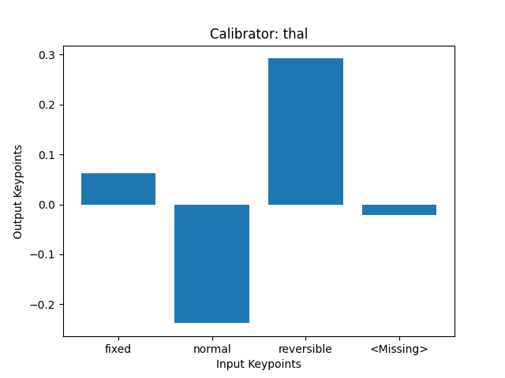

# Calibrators

Calibrators are one of the core concepts of the PyTorch Lattice library. The library currently implements two types of calibrators:

- [`CategoricalCalibrator`](../api/layers.md#pytorch_lattice.layers.CategoricalCalibrator): calibrates a categorical value through a mapping from a category to a learned value.
- [`NumericalCalibrator`](../api/layers.md#pytorch_lattice.layers.NumericalCalibrator): calibrates a numerical value through a learned piece-wise linear function.

Categorical Calibrator          | Numerical Calibrator
:------------------------------:|:----------------------------------------:
 | 

## Feature Calibrators

In a [calibrated model](model_types.md), the first layer is the calibration layer that calibrates each feature using a calibrator that's learned per feature.

There are three primary benefits to using feature calibrators:

- Automated Feature Pre-Processing. Rather than relying on the practitioner to determine how to best transform each feature, feature calibrators learn the best transformations from the data.
- Additional Interpretability. Plotting calibrators as bar/line charts helps visualize how the model is understanding each feature. For example, if two input values for a feature have the same calibrated value, then the model considers those two input values equivalent with respect to the prediction.
- [Shape Constraints](shape_constraints.md). Calibrators can be constrained to guarantee certain expected input/output behavior. For example, you might a monotonicity constraint on a feature for square footage to ensure that increasing square footage always increases predicted price. Or perhaps you want a concavity constraint such that increasing a feature for price first increases and then decreases predicted sales.

## Output Calibration

You can also use a `NumericalCalibrator` as the final layer for a model, which is called output calibration. This can provide additional flexibility to the overall model function.

Furthermore, you can use an output calibrator for post-training distribution matching to calibrate your model to a new distribution without retraining the rest of the model.

