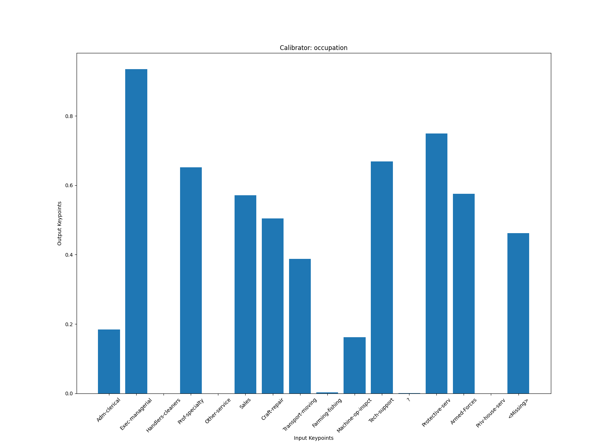

# UCI Adult Income

For this walkthrough you are going to fit a `Classifier` to the UCI Adult Income dataset to predict whether or not a given input makes more or less than $50K.

## Install and import packages

On top of PyTorch Lattice, you will be using `scikit-learn` for calculating metrics to evaluate your classifiers. First, make sure you have these packages installed:

```shell
$ pip install pytorch-lattice scikit-learn
```

Next, import these packages in your script:

```py
from sklearn import metrics

import pytorch_lattice as pyl
```

## Load the UCI Adult Income dataset

The `Classifier` expects a `pandas.DataFrame` containing the training data and a `numpy.ndarray` containing the labels for each example. You can use the PyTorch Lattice datasets module to load the data in this form:

```py
X, y = pyl.datasets.adult()
```

## Create and configure a `Classifier`

Next, you'll want to create a `Classifier` that you can use to fit to a calibrated model to the data. When creating a `Classifier`, the only required field is the list of features to use. For this guide, you are only going to use four features: `age`, `education_num`, `occupation`, and `hours_per_week`.

By default the calibrated modeling type used will be a calibrated linear model. If you'd like to further configure the model, you can provide a `model_config` with the attributes of your choice. For this guide, you will train a `CalibratedLattice` model.

```py
model_config = pyl.model_configs.LatticeConfig()
clf = pyl.Classifier(
    ["age", "education_num", "occupation", "hours_per_week"], model_config
)
```

## Configure features

One of the primary benefits of using PyTorch Lattice models is the ability to easily add shape constraints that guarantee certain real-world expectations. For example, it would make sense that someone with a higher level of education would be more likely to make more than $50K compared to someone with a lower level of education, all else being equal. Similarly, you might expect someone who works more hours per week to be more likely to make more than $50K compared to someone who works less hours per week, all else being equal.

```py
clf.configure("education_num").monotonicity("increasing")
clf.configure("hours_per_week").monotonicity("increasing")
```

PyTorch Lattice makes it very easy to ensure that the model behaves as expected even after training on data. By setting the `monotonicity` field to `increasing` for both `education_num` and `hours_per_week`, you will guarantee that increasing either of those features will increase the prediction (so long as no other feature values change).

Of course, the classifier is still trained on data, so the only thing guaranteed is the relationship. How much increasing `education_num` or `hours_per_week` will increase the prediction will still be learned from training. Ultimately you are reducing the risk of unknown outcomes while still learning from data.

## Fit the classifier to the data

Now that you've configured the classifier, fitting it to the data is easy:

```py
clf.fit(X, y, batch_size=1024)  # using a larger batch size for faster training
```

There are additional training configuration options that you can set such as the number of epochs for which to fit the classifier, the learning rate, and the batch size, which you can set as parameters of the `fit` function.

## Generate predictions and evaluate AUC

Once you've fit your classifier it's easy to generate predictions:

```py
preds = clf.predict(X)
```

You can then use `scikit-learn` to calculate `AUC` to evaluate the predictive quality of your classifier:

```py
fpr, tpr, _ = metrics.roc_curve(y, preds)
print(f"Train AUC: {metrics.auc(fpr, tpr)}")
# Train AUC: 0.8165439029459205
```

## Plot calibrators for analysis

Plotting the calibrators for each feature can help visualize how the model is understanding the features. First, try plotting the calibrator for `occupation`:

```py
pyl.plots.calibrator(clf.model, "occupation")
```



You can see here how each category for `occupation` gets calibrated before going into the lattice layer of the model, which shows us relatively how the model understands each category. For example, you can see that the model things that `Sales` and `Armed-Forces` have a similar likelihood of making more than $50K.

Interestingly, plotting the calibrator for `hours_per_week` shows that there's a flat region starting around ~52 hours. This indicates that there is a chance that the `hours_per_week` feature is not actually monotonically increasing, in which case you might consider training a new classifier where you do not constrain this feature.

When setting constraints, there are two things to keep in mind:

1. Do you want to guarantee the constrained behavior regardless of performance? In this case, setting the constraint can make sure that model behavior matches your expectations on unseen examples, which is especially useful when using a model to make decisions.
2. Does the model have better performance on a validation dataset if you remove the constraint? It is important to remember that adding constraints to a feature may result in worse performance on the training set but actually result in better performance on the validation set. This is because the constraint helps the model to better handle unseen examples if the constraint should in fact be set.
